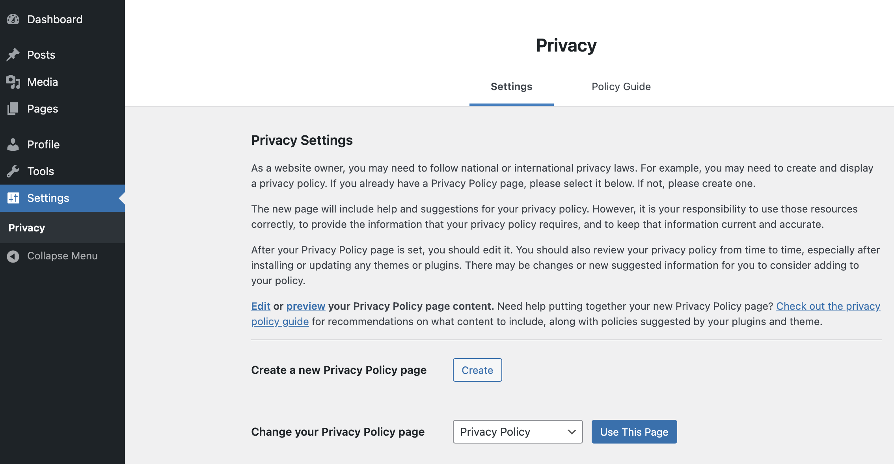

# Editor Can Manage Privacy Options

A lightweight WordPress plugin that grants the **Editor** role access to manage site Privacy Settings — capabilities normally restricted to Administrators.




## Why This Plugin?

By default, only Administrators can configure the site's privacy policy settings (selecting the Privacy Policy page, accessing the privacy guide, etc.). This plugin safely extends that access to trusted Editors without broadly elevating their administrative capabilities.

## Features

- Maps the core `manage_privacy_options` meta capability to an Editor-level base capability (`edit_pages`, filterable)
- Adds the Privacy submenu under **Settings** for Editors (only if core hasn’t already exposed it)
- Prevents duplicate "Privacy" menu entries (CSS + defensive late cleanup)
- Request‑scoped temporary elevation only on privacy-related pages
- Avoids granting unrelated high-risk capabilities like `manage_options`
- Heuristic admin detection (treats users with high-level caps as admins)

## How It Works (Technical)

Hooks used:
- `map_meta_cap` – remaps `manage_privacy_options` to a safer base capability
- `admin_menu` – adds the Privacy menu (and late duplicate cleanup)
- `admin_init` – sets up request-scoped access if viewing privacy pages
- `user_has_cap` – temporarily grants `manage_options` only when core checks it on privacy pages
- `admin_head`, `admin_print_styles`, `in_admin_footer` – inject CSS to hide duplicate submenu entries

### Capability Mapping Filter
You can customize the base capability via the `epm_privacy_base_cap` filter:

```php
add_filter( 'epm_privacy_base_cap', function( $default ) {
    return 'edit_others_posts'; // or another appropriate capability
} );
```

## Installation

- **Quick Install**

   - Download [`editor-can-manage-privacy-options.zip`](https://github.com/soderlind/editor-can-manage-privacy-options/releases/latest/download/editor-can-manage-privacy-options.zip)
   - Upload via  Plugins > Add New > Upload Plugin
   - Activate the plugin.

- **Composer Install**

   ```bash
   composer require soderlind/editor-can-manage-privacy-options
   ```

- **Updates**
   * Plugin [updates are handled automatically](https://github.com/soderlind/wordpress-plugin-github-updater#readme) via GitHub. No need to manually download and install updates.

## Requirements
- WordPress 6.5+
- PHP 8.2+


## Security Notes
- Scope limited strictly to privacy-related pages
- No persistent role modification; all adjustments are dynamic
- Defensive checks prevent privilege creep into unrelated admin areas

## FAQ
**Does this let Editors change other site-wide admin options?**  
No. Only privacy-related access is facilitated.

**Can I change which role gets access?**  
Yes, by mapping to a different capability using the `epm_privacy_base_cap` filter.

**Why inject CSS for duplicates?**  
Rare timing edge cases can produce temporary duplicate menu entries. CSS plus late cleanup ensures a clean UI.

**Does it work in multisite?**  
Yes in principle; network-level elevated capabilities mark a user as effectively admin and bypass the editor logic.

## Development
Pull requests and issues welcome.

## License
MIT — see `LICENSE` file.

## Author
[Per Søderlind](https://github.com/soderlind)
